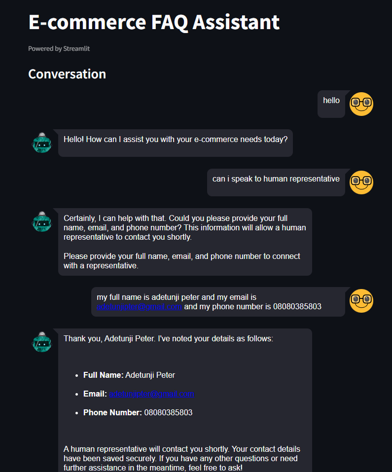

# E-commerce FAQ Assistant

## Overview

The E-commerce FAQ Assistant is a conversational AI designed to assist users with e-commerce-related queries. It provides information on order statuses, return policies, and connects users with human representatives when needed. The system is built using OpenAI's GPT-4 model and is integrated with a Streamlit frontend and a FastAPI backend.

## Features

- *Order Status Inquiry*: Users can inquire about the status of their orders by providing their order ID.
- *Return Policy Information*: Detailed information about return policies, including general return policy, non-returnable items, and refund processes.
- *Human Representative Connection*: Users can request to speak with a human representative by providing their contact information.
- *Conversation History*: The system saves user interaction history to personalize responses and enhance user experience.
- *Contact Information Extraction*: The system can extract and save user contact information for follow-up by a human representative.

## Project Structure

config/
    __pycache__/
    __init__.py
    config.py
data/
    USERS/
    { } 12.conversation.json
    { } 222.conversation.json
    { } 244.conversation.json
    user_contacts.csv
Evaluation/
    Chatbot Evaluation Report.pdf
    evaluation_results.json
    Evaluation.ipynb
    faq_data.csv
src/
    __init__.py
    chat_service.py
    faq.py
    system_prompt.py
utils/
    __pycache__/
    __init__.py
    contact_parser.py
    utils.py
dockerignore
.env
app.py
docker-compose.yml
Dockerfile
main.py
requirements.txt

## Setup and Installation

## Prerequisites

Ensure you have the following installed on your system:
1. *Python 3.8 or higher or 3.12.5 exactly*
2. *pip (Python package installer)*

1. *Clone the Repository*:
   bash
   git clone https://github.com/Adetayo047/SavannahTech_Conversational_Agent.git
   cd SavannahTech_Conversational_Agent
   
   #### Create a Virtual Environment

Create and activate a virtual environment to isolate dependencies:

- *Windows*:
  bash
  python -m venv venv
  venv\Scripts\activate
  

- *Mac/Linux*:
  bash
  python3 -m venv venv
  source venv/bin/activate
  
   
2. *Install Dependencies*:
   bash
   pip install -r requirements.txt
   

3. *Set Up Environment Variables*:
   - Create a .env file in the root directory.
   - Add your OpenAI API key to the .env file:
     plaintext
     OPENAI_API_KEY=your_openai_api_key
     

4. *Run the Streamlit App*:
   bash
   streamlit run app.py
   

5. *Run the FastAPI Backend*:
   bash
   uvicorn main:app --reload
   

6. *Docker Setup*:
   - Build the Docker image:
     bash
     docker-compose build
     
   - Run the Docker container:
     bash
     docker-compose up
     

## Usage

### Streamlit Frontend

1. Open the Streamlit app in your browser.
2. Enter your User ID and start chatting with the FAQ assistant.

### FastAPI Backend

- *Endpoint*: /ask
- *Method*: POST
- *Request Body*:
  json
  {
    "user_id": "12345",
    "question": "What is my order status?"
  }
  
- *Response*:
  json
  {
    "response": "Your order is in transit."
  }
  

## API Documentation (OpenAPI/Swagger)

The FastAPI backend automatically generates OpenAPI documentation, which can be accessed at http://localhost:8000/docs when the server is running. This interactive documentation allows you to test the API endpoints directly from the browser.

### Example API Request

1. *Endpoint*: /ask
2. *Method*: POST
3. *Request Body*:
   json
   {
     "user_id": "12345",
     "question": "What is my order status?"
   }
   
4. *Response*:
   json
   {
     "response": "Your order is in transit."
   }
   

## Detailed Module Documentation

### config.py

This module handles configuration settings, including loading environment variables and defining file paths.

- *OPENAI_API_KEY*: The API key for OpenAI.
- *USERS_DIRECTORY*: Directory path for storing user conversation history.
- *CONTACTS_CSV_PATH*: File path for storing user contact information.
- *LOG_LEVEL*: Logging level configuration.

### chat_service.py

This module contains the ChatService class, which handles chat interactions with the user.

- *chat_function*: Handles user messages, generates responses using OpenAI's GPT-4 model, and saves conversation history and contact information.

### faq.py

This module initializes the FAQ system and ensures necessary directories and files are created.

- *create_required_files*: Creates necessary directories and files for storing user data.
- *chat_function*: Wrapper for the chat service function.

### system_prompt.py

This module generates the system prompt for the chat model.

- *generate_system_prompt*: Generates a detailed system prompt based on user contact information.

### contact_parser.py

This module extracts contact information from user messages using regular expressions.

- *extract_contact_info*: Extracts full name, email, and phone number from the user's message.

### utils.py

This module provides utility functions for file operations and logging.

- *create_directory*: Creates a directory if it doesn't exist.
- *create_csv_file*: Creates a CSV file with headers if it doesn't exist.
- *load_conversation_history*: Loads conversation history for a user.
- *save_conversation_history*: Saves conversation history for a user.
- *save_contact_info*: Saves contact information to a CSV file.

### app.py

This module contains the Streamlit frontend for the FAQ assistant.

- *update_user_id*: Callback to update the user ID.
- *process_input*: Callback to process user input and generate responses.

### main.py

This module contains the FastAPI backend for the FAQ assistant.

- *ask_question*: Endpoint to handle user queries and return responses.

## Chatbot Evaluation Report

### 1. Overview

This report evaluates the performance of the chatbot based on its responses to user queries. The chatbot's performance is assessed using three primary evaluation metrics: Accuracy, Relevance, and Satisfaction. Additionally, more advanced metrics such as BLEU, ROUGE, and METEOR scores are calculated to assess the quality of the chatbot's responses in comparison to predefined answers from a CSV file.

### 2. Conclusion and Recommendations

- The chatbot's responses were generally helpful, but they lacked a high degree of precision when compared to predefined answers. There is room for improvement in terms of accuracy and alignment with expected responses.
- While the chatbot's responses were relevant and clear, they could be refined to better match the expected language used in predefined answers.
- Future iterations of the chatbot should include improvements in tokenization and response generation, which may help to better handle metrics like METEOR.
- A better handling of variations in language and response phrasing could improve both the accuracy and relevance scores.

Overall, the chatbot performed reasonably well in providing relevant information and the response is good. This chatbot is an intelligent bot and it is not expected to give the same or exact answer to the question. That is why it cannot be judged based on accuracy and relevance but based on satisfaction, BLEU Score, and ROUGE Scores, it performed very well.

for more detailed analysis of the and explaination Evaluation\Evaluation.md

## Contributing

Contributions are welcome! Please fork the repository and submit a pull request with your changes.

## Contact

For any questions or issues, please open an issue on the GitHub repository or contact the maintainer directly.